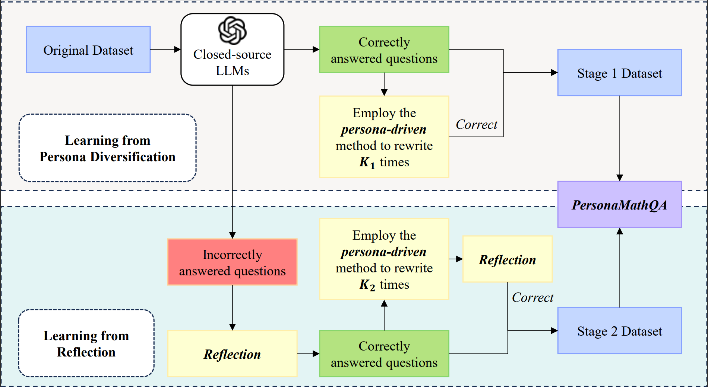
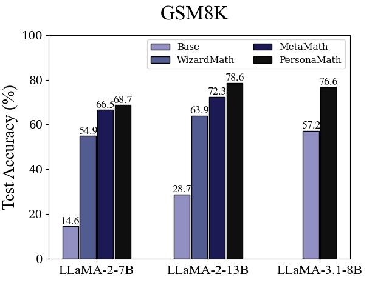
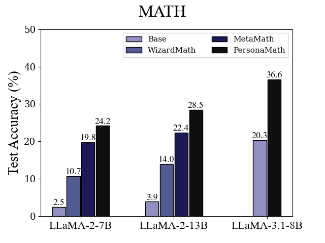

# PersonaMath: Enhancing Math Reasoning through Persona-Driven Data Augmentation

<p align="center">
🤗 <a href="https://huggingface.co/datasets/jingluo/PersonaMathQA" target="_blank">Dataset</a> • 📃 <a href="" target="_blank">Paper</a><br>
</p>

<p align="center" width="100%">
<a >

</a>
</p>

## Comparing PersonaMath with the current advanced open-source LLMs.


| Model               | GSM8k Pass@1 | MATH Pass@1 |
|---------------------|--------------|-------------|
| LLaMA-2-7B          | 14.6         | 2.5         |
| LLaMA-3.1-8B          | 57.2         | 20.3         |
| Falcon-40B          | 19.6         | 2.5         |
| Baichuan-2-7B   | 24.5        | 5.6         |
| DeepSeek-V2-Lite   | 41.1        | 17.1         |
| LLaMA-2-13B         | 28.7         | 3.9         |
| Baichuan-2-13B   | 52.8        | 10.1         |
| GLM-4-9B        | 84.0         | 30.4         |
| LLaMA-2-34B         | 42.2         | 6.24        |
| LLaMA-3.1-70B          | 83.7         | 41.4         |
| Qwen2.5-7B             | 85.4         | 49.8          |
| WizardMath-7B       | 54.9         | 10.7        |
| LLaMA-2-70B         | 56.8         | 13.5        |
| WizardMath-13B      | 63.9         | 14.0        |
| MetaMath-7B         | 66.5    | 19.8    |
| MetaMath-13B        | 72.3     | 22.4    |
| MetaMath-Mistral-7B | 77.7    | 28.2   |
| MetaMath-Llemma-7B  | 69.2     | 30.0    |
| WizardMath-70B      | 81.6         | 22.7        |
| MetaMath-70B        | 82.3     | 26.6   |
| :rocket: **PersonaMath-LLaMA-2-7B**        | **68.7**     | **24.2**  |
| :rocket: **PersonaMath-LLaMA-2-13B**        | **78.6**     | **28.5**   |
| :rocket: **PersonaMath-LLaMA-3.1-8B**      | **76.6**     | **36.6**   |
| :rocket: **PersonaMath-Qwen2.5-7B**      | **84.3**     | **56.6**   |

## Usage

Our PersonaMathQA dataset is available on [Hugging Face](https://huggingface.co/datasets/jingluo/PersonaMathQA). You can load it by running the following code:
```python
from datasets import load_dataset
ds = load_dataset("jingluo/PersonaMathQA")
```

Run the following code to implement **DeepSpeed ZeRO-2** Stage for model training:
```bash
bash run_zero2.sh
```

Run the following code to implement **DeepSpeed ZeRO-3** Stage for model training:
```bash
bash run_zero3.sh
```

We use vLLM to evaluate our model. Run the following code to evaluate on GSM8K: 
```
CUDA_VISIBLE_DEVICES=0 python3 eval_gsm8k.py --model /path/to/model --data_file /GSM8K_test.jsonl
```

and use the following code for MATH:
```
CUDA_VISIBLE_DEVICES=0 python3 eval_math.py --model /path/to/model --data_file /MATH_test.jsonl
```

Thanks for the open source code of [MetaMath](https://github.com/meta-math/MetaMath/tree/main). Some of our codes are based on them.
